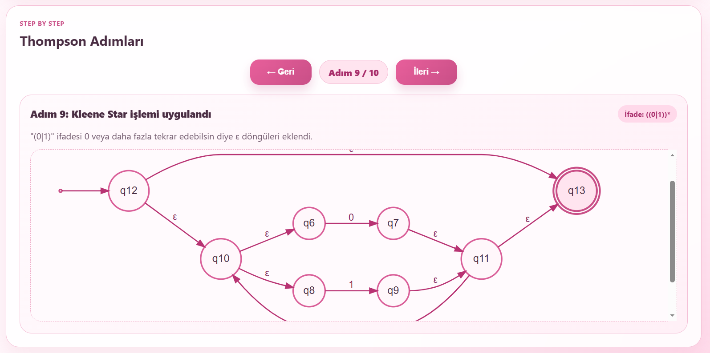
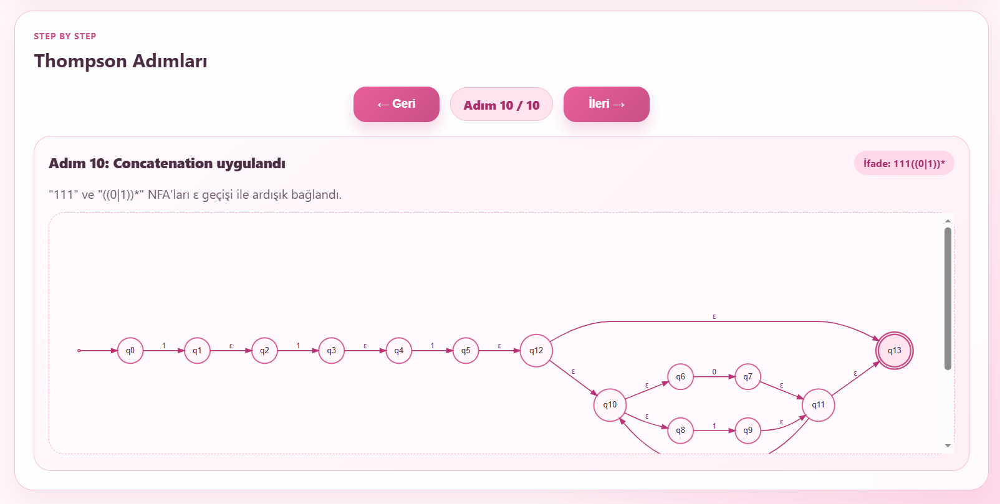
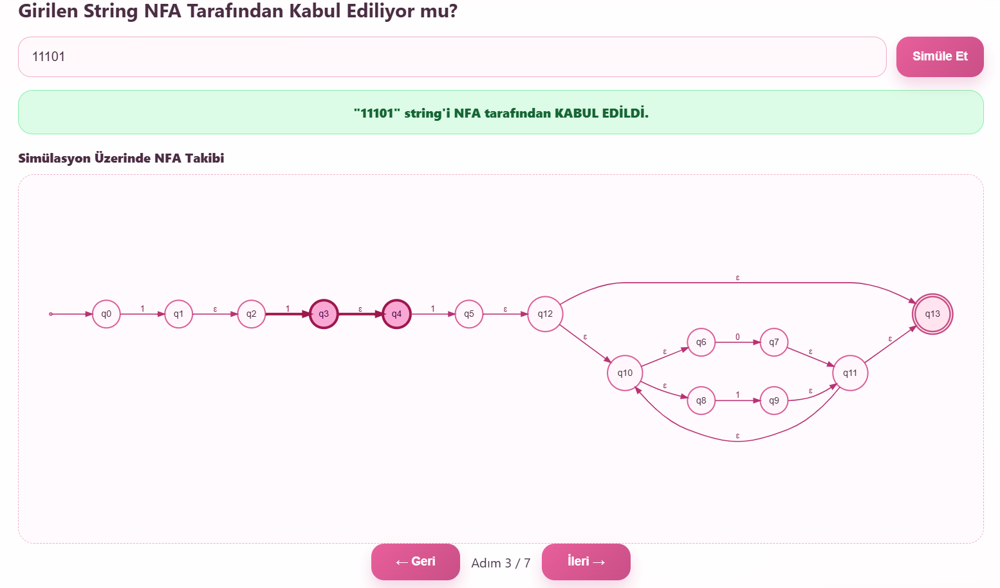
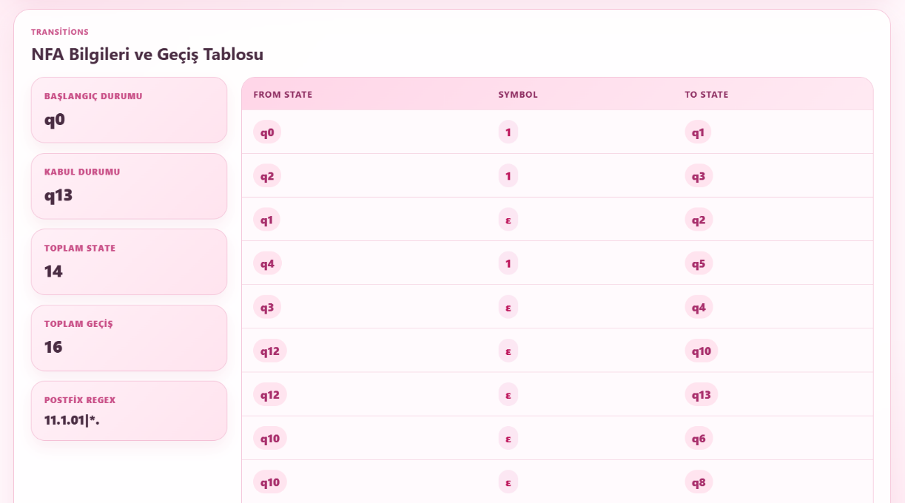

<div align="center">

# 🚀 Regex Thompson ε-NFA Visualizer

**Interactive Thompson Construction visualizer for converting Regular Expressions into ε-NFAs step by step**

[]()
[]()
[]()

<br>

> *A browser-based educational tool that visualizes how regular expressions are transformed into ε-NFAs using Thompson’s Construction Algorithm.*

<br>

[](https://zeynpakn.github.io/regex-thompson-nfa/)

</div>

---

## 📖 Overview

Built for Formal Languages & Automata Theory courses, this project converts regular expressions into ε-NFAs step by step using Thompson's Construction Algorithm.

Instead of showing only the final automaton, the application visualizes every intermediate construction stage, postfix conversion process, ε-transitions, and simulation steps interactively inside the browser.

---

## ✨ Features

- 🎯 Regex Parsing with concatenation, alternation (`|`), Kleene star (`*`), and grouping
- ⚙️ Thompson Construction Algorithm implementation
- 🧠 Shunting-yard postfix conversion
- 🎨 Step-by-step ε-NFA visualization
- 🧪 Interactive string simulation
- 📊 Transition table generation
- 📂 Regex loading from `.txt` and `.json`
- 💡 Quick regex examples
- 🌐 Browser-based interface with no installation required

---

## ⚙️ How It Works

1. The regex is parsed and explicit concatenation operators are inserted.
2. The expression is converted into postfix notation using the Shunting-yard algorithm.
3. Thompson fragments are generated for each postfix token.
4. NFAs are merged using concatenation, union, and Kleene star operations.
5. Every construction step is rendered as a Graphviz diagram.
6. Input strings are simulated using ε-closure and move operations.

---

## 🚀 Quick Start

### Clone Repository

```bash
git clone https://github.com/zeynpakn/regex-thompson-nfa.git
cd regex-thompson-nfa
```

### Run Locally

```bash
# Python
python3 -m http.server 8080

# Node.js
npx http-server
```

Open:

```text
http://localhost:8080
```

---

## 📁 Project Structure

```text
regex-thompson-nfa/
├── assets/
│   ├── favicon.png
│   └── screenshots/
├── css/
│   └── style.css
├── examples/
│   ├── example.json
│   └── example2.txt
├── js/
│   └── app.js
└── index.html
```

---

## 📸 Example Walkthrough — `(a|b)*abb`

### Step-by-Step Thompson Construction

The application creates symbol NFAs first, then combines them using union, concatenation, and Kleene star operations.

<div align="center">



</div>

---

### Final ε-NFA

After all Thompson operations are completed, the final ε-NFA is generated automatically.

<div align="center">



</div>

---

### String Simulation

The simulation tab highlights active states and traversed transitions while processing the input string.

<div align="center">



</div>

---

### Transition Table

All transitions and NFA statistics are displayed inside the Transitions tab.

<div align="center">



</div>

---

## 🛠️ Technologies Used

- HTML5
- CSS3
- Vanilla JavaScript
- Graphviz DOT
- Viz.js
- Thompson Construction Algorithm
- Shunting-yard Algorithm

---

## 📂 Supported Regex Operations

| Operator | Meaning |
|---|---|
| `|` | Union |
| `*` | Kleene Star |
| `()` | Grouping |
| Concatenation | Sequential transitions |

---

## 🎓 Educational Purpose

This project was developed as a Formal Languages & Automata Theory course project to help students better understand:

- Thompson Construction
- ε-NFA structures
- Regex parsing
- Postfix conversion
- ε-closure computation
- Finite automata simulation

---

<div align="center">

Made with ❤️ by Zeynep Akın

**Warning: excessive ε-transitions may cause automata addiction.**

</div>
